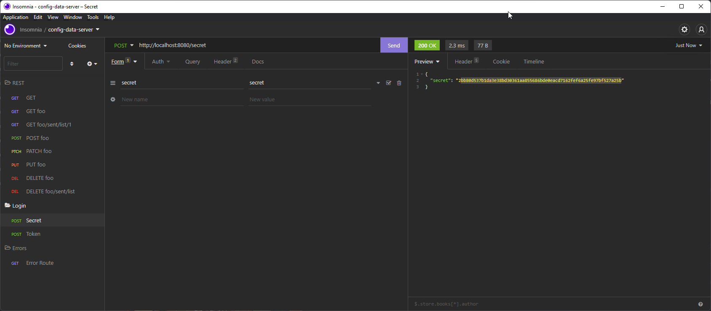
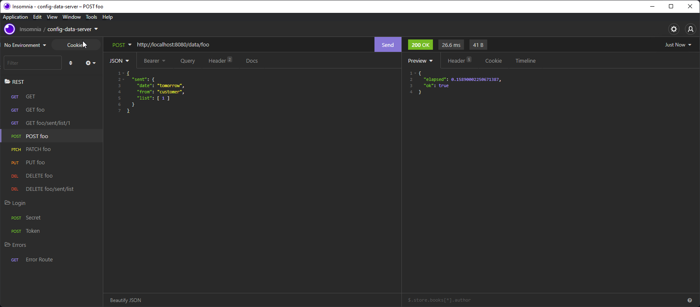
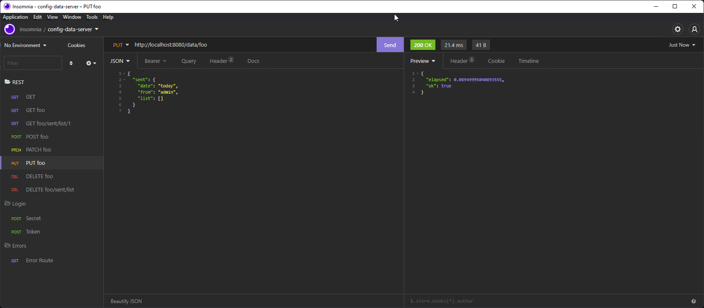
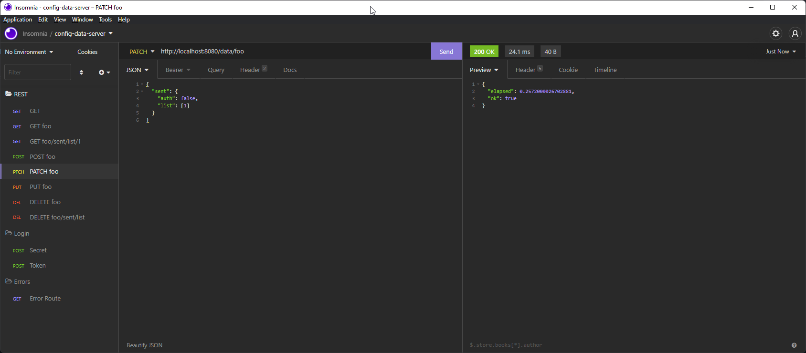
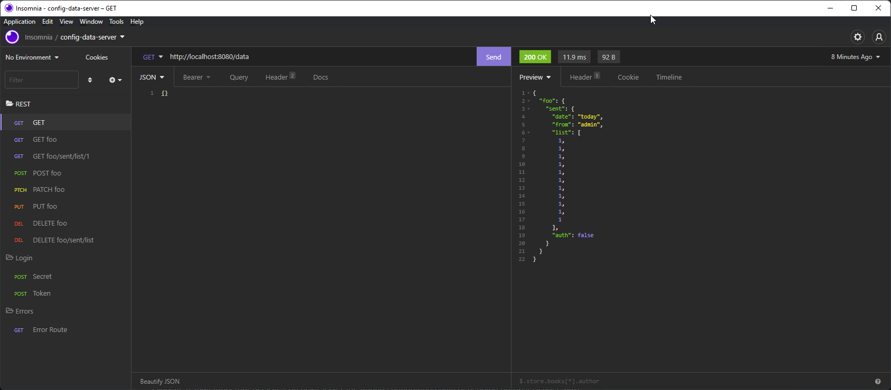
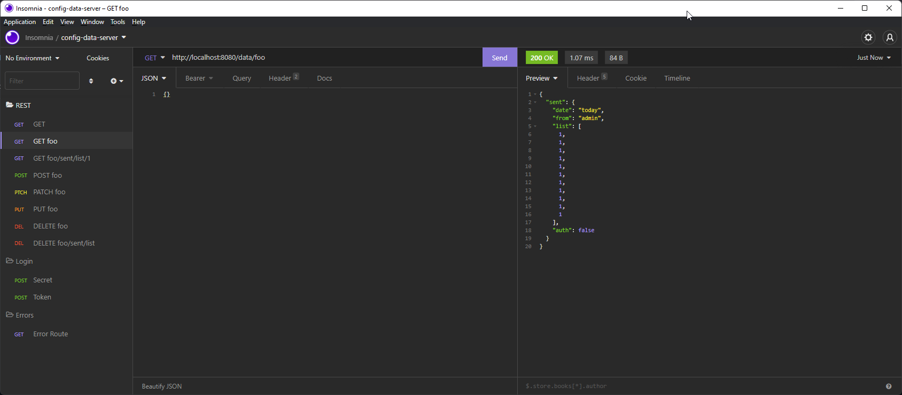
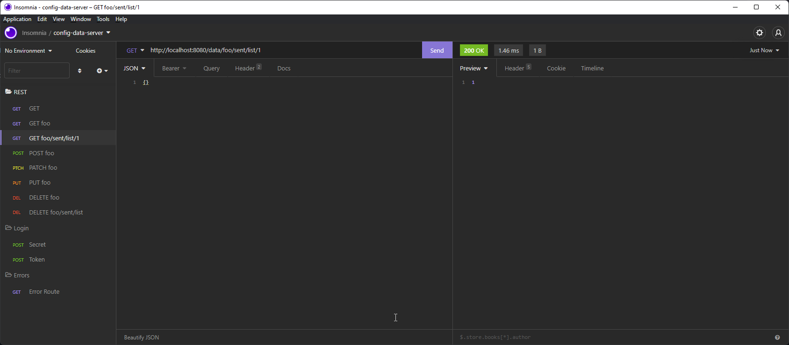

# Config Data Server

## What is CDS

JSON REST InMemory (but persisted on disk) Server for storing configuration data depending on Host Header, with JWT protection for modification.

## Docker

Building the Docker image

```bash
docker build . --tag cds-server:alpine-3.14 --tag cds-server:latest
```

Creating Volume & Container

```bash
docker volume create cds-server-data
docker create -it -p 8080:8080 -v cds-server-data:/data -it --name cds-server cds-server:latest
docker run cds-server
```

> THE SERVER WILL FAIL WITHOUT A CONFIGURATION FILE, ensure that the volume has a complete configuration file on it!

Copying data to the volume

```bash
docker cp data/app-config.json cds-server:/data/app-config.json
```

## API Config

The server itself needs a minimal set of configuration values to work:

```json
{
    "users": {
        "admin": {
            "secret": "2bb80d537b1da3e38bd30361aa855686bde0eacd7162fef6a25fe97bf527a25b", //secret
            "apps": [
                "demo"
            ]
        }
    },
    "apps": {
        "demo": {
        }
    }
}
```

- `Users` defines the users from the Server (for writing).
    - `admin` is the Username from this sample user
        - `secret` is the hashed password for this account (see `/auth/secret`) 
        - `apps` is a list of apps a user has access to

- `Apps` define the Configuration root paths by host. E.g. if you send a Header with `Host: demo` all auth & data operations are executed against the `demo` app.

## API

### Overview

There are only 2 "sets" of apis

- auth
 / Everything token related is under `/auth`
- data
 / Everthing data related is under `/data`

### AUTH

 - `[POST] /auth/secret`

If you start from a fresh install, you will have to use `/auth/secret` to find out the hash for your password.

The `/auth/secret` Request takes URL Encoded Form data with a `secret` field.



Once you obtained this secret, you can paste the hash in the config and your user is good to go.

 - `[POST] /auth/token`

You can authenticate yourself (request a token) with `/auth/token`. This request also takes URL Encoded Form data with a username and a password field.

If the the server deemed the login credentials as correct, it will return a token that you can use for PUT, POST, PATCH, DELETE operations. As mentioned before GET requests do require user authentication.

### DATA

The Path for all data operations can be a navigation inside the JSON object itself.

E.g.

If you have have a app store object like this json below, you can use /data/foo to only get everthing below foo. If you want to go even further in the object, you can do it too with /data/foo/sent/from, that will return you only the string admin, but saves a bit of object parsing on the caller side.

```json
{
    "foo": {
        "sent": {
            "date": "today",
            "from": "admin",
            "list": [
                1,
                1
            ]
        }
    }
}
```

- `[POST] /data`

The first method you will use is most likely **POST** to store data on the server:

The request takes json data. The resulting object will then be stored under the root app data json node. The Post request is also **REST** conform and will return only okay, if there is no node present at that location.

E.g. you want to set /foo but /foo is already a "1" on the server, the Request will fail. (see **PUT** if you want to overwrite values)



- `[PUT] /data`

**PUT** takes json data and works the same way as **POST** except that if a node is already present it **REPLACES** its entire content with the body from the request.



- `[PATCH] /data`

**PATCH** takes json data and, as the name rightfully suggest, patches an object in also included subobjects and lists.

E.g. if you **PATCH** an objects that contains a list, the Server will always append all the items to the existing List.



- `[GET] /data`

**GET** takes no data and returns you everything under the app store object. This method can be called from any site and will return all the data from that data path below this app store object. Just be carefull with third party apps, since the Host header will be used to destingish which app store object to refer to once the server tries to access its content.

Request everything;



Request foo;



Request the first item from the list on foo;



## Notes

This was a project I wanted to do for a long time but I didn't really have time/motivation. It also was relativly easy to implement (under 8h). Bonus Points: It dosen't use any external npm packages. Not even for JWT auth (thanks to the awesome nodejs base packages).

Thanks for reading and have a good day or night.


